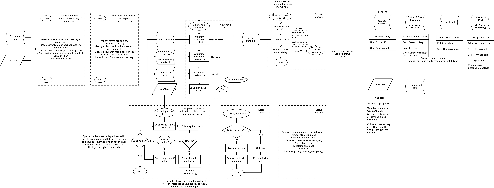
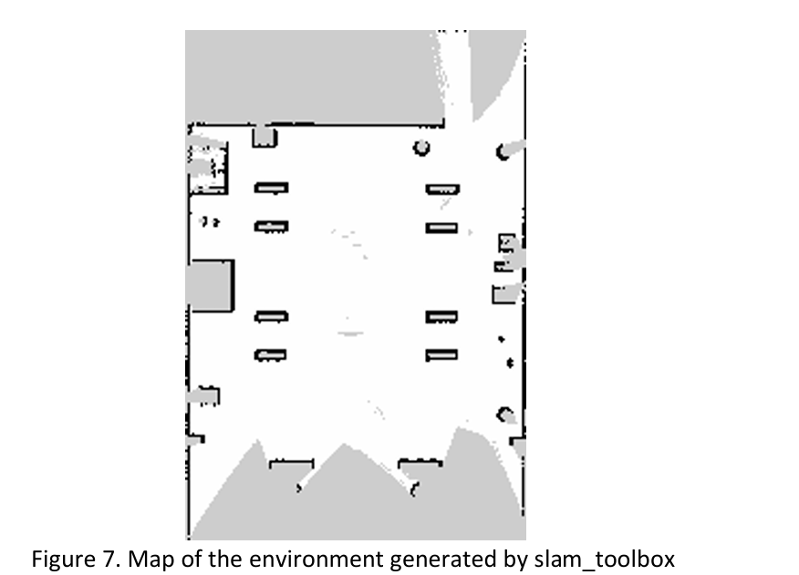
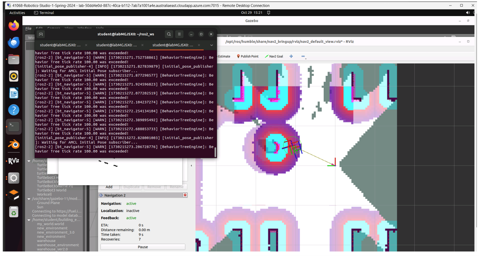
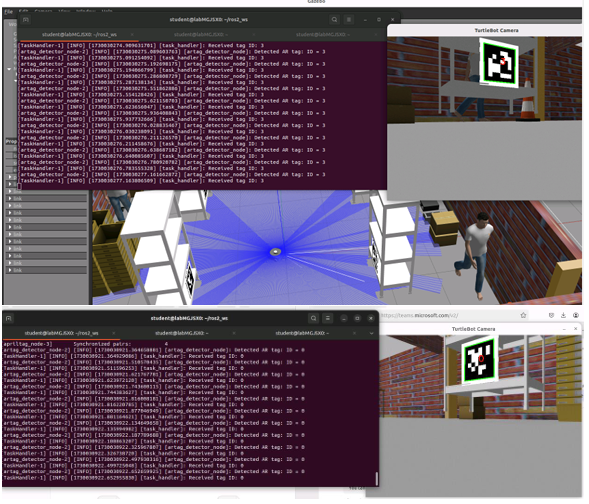

# Project for Robotics Studio 1 Subject - Warehouse robot simulation with TurtleBot 

The Robotic Studio 1 Smart Factory project develops software capabilities to allow a robotic platform 
within a warehouse to perform useful activities, avoiding human risk and WHS concerns. The 
project implementation makes use of a TurtleBot to demonstrate capabilities in handling 
warehouse logistics. The demonstration platform will first navigate and explore a warehouse 
environment using LiDAR, as well as annotating its map with the locations of human stations 
and products.  
In addition to producing a navigation map, the system will also be capable of measuring 
environmental conditions as it travels, specifically humidity and temperature along its path. 
This information will be relayed to an operator to monitor the warehouse and ensure product 
longevity. 
Once a map has been prepared, the system will receive commands to transfer specific 
products to specific human stations or vice versa. It will make observations to avoid obstacles 
during travel and will implement velocity limits for safety when carrying heavy loads. Focusing 
on the software scope, hardware implementation will be avoided, and all tests are performed 
in simulation via Gazebo. 

The system can be considered a proof-of-concept implementation for further robotic systems 
to build upon. Further work could include implementing specific hardware to physically 
interact with products, navigation capabilities real-world environments with a wider range of 
conditions.

# System flow chart 

# Map generated with slam_toolbox

# A node to detect and read April Tag 

